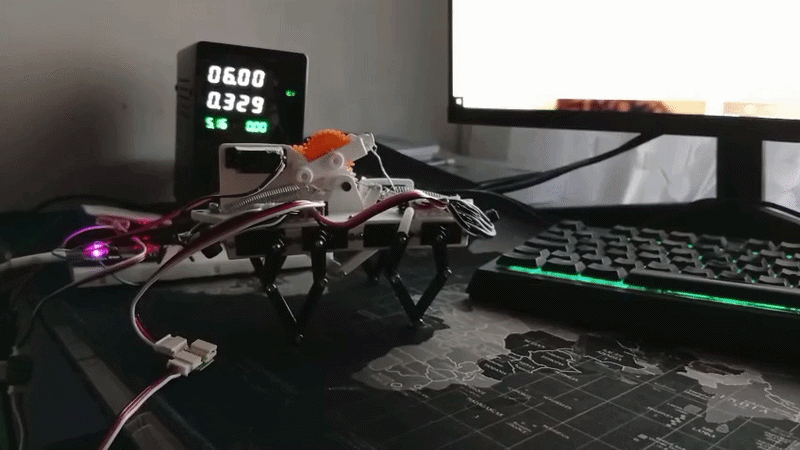
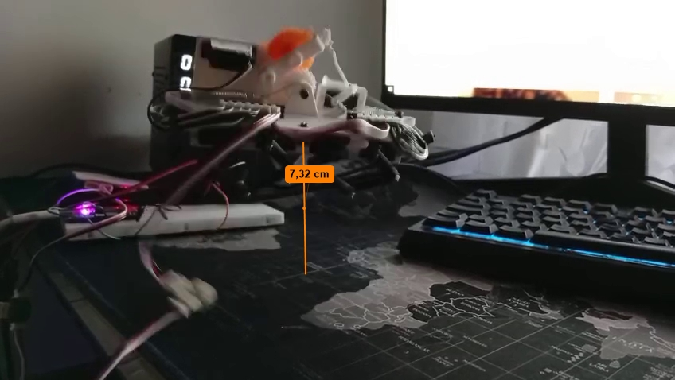
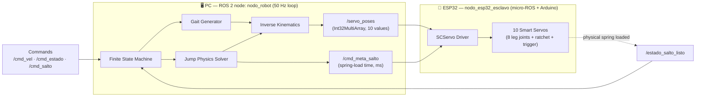
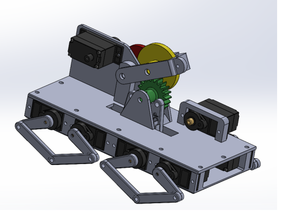
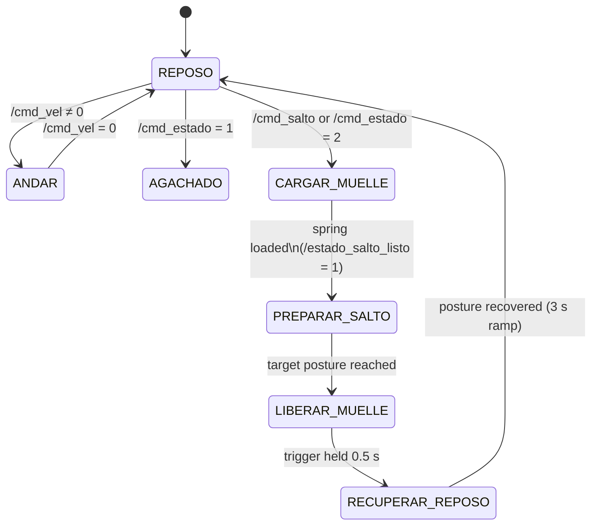

<div align="center">

# Jumping Quadruped Robot
### Mechatronic Prototype for Height- and Direction-Controlled Jumping

*A quadruped robot built from scratch with an integrated spring-loaded jump mechanism, capable of executing software-controlled jumps with programmable height and direction.*


-blue)


</div>

---

## 📽️ Demo

<p align="center">
  
  
</p>

---

## 🧭 Overview

This repository contains the full mechatronic development of my **Final Degree Thesis (TFG)**: a **quadruped robot designed and built entirely from scratch**, mechanically capable of storing elastic energy in a spring system and releasing it on command to perform a **jump whose height and direction are controlled entirely in software**.

The project was developed end-to-end, across every layer a real robotic product needs:

- **Physical modeling** — the robot's geometry, leg kinematics and jump dynamics were derived analytically, so the software controls a system whose behavior is *understood*, not just tuned by trial and error.
- **Mechanical design** (CAD, linkage synthesis, spring sizing) — SolidWorks.
- **Embedded firmware** (deterministic servo actuation bridge) — ESP32 + micro-ROS + Arduino.
- **Robot software / control** (inverse kinematics, gait generation, jump physics solver, finite-state machine) — ROS 2, C++.

The central idea: give the robot a **single high-level command** — "walk this fast," "turn this much," "jump to this height" — and let the software work out *everything* underneath: joint angles, timing, posture, spring compression, and actuation duration. No per-jump manual calibration.

---

## ✨ Key Features

- 🦵 **Custom 5-bar rhombus leg mechanism** — each leg is a symmetric 5-link linkage, actuated by only 2 servos, giving a lightweight and mechanically robust walking leg with full 2D foot-position control.
- 🧠 **Real-time inverse kinematics** — closed-form, geometry-based IK solver per leg, running at 50 Hz, converting desired foot (x, y) coordinates into servo angles with safety-clamped travel limits.
- 🚶 **Parametric gait engine** — trot-like gait generated from a single global phase clock, with independent per-leg phase offset, adjustable stride length, and live turning compensation (differential stride between left/right or front/rear legs).
- 🚀 **Physics-based jump planner** — for a given target height, the controller sweeps launch angles to find the one that **minimizes the required take-off velocity** (accounting for ground friction and take-off geometry), then derives:
  - the optimal chassis pitch angle,
  - the required spring compression (2 springs in series + 2 in parallel),
  - the exact servo actuation time needed to load that compression through the gearbox/reel transmission.
- 🎯 **Direction control** — jump distance/direction is decoupled from height via the same solver, keeping the mechanism within the physically viable spring-compression range.
- ⚙️ **Spring-loaded release mechanism** — a compact latch (ratchet + trigger servo) loads the spring pack via a geared winch and releases it on a single software command.
- 🔗 **PC ↔ MCU split architecture** — all heavy computation (IK, gait, jump dynamics) runs centralized on a PC via ROS 2; a lightweight ESP32 running micro-ROS acts purely as a real-time servo driver, keeping the embedded side simple and deterministic.
- 🧩 **Finite-state machine control** — clean state machine (`REPOSO`, `ANDAR`, `AGACHADO`, `PREPARAR_SALTO`, `CARGAR_MUELLE`, `LIBERAR_MUELLE`, `RECUPERAR_REPOSO`) governing the full walk → crouch → arm → jump → recover sequence, with built-in safety pauses between behaviors.

---

## 🏗️ How the Architecture Works (Intuitive Overview)

Think of the system as a **brain-and-spine** split:

- **The brain (PC, ROS 2 node `nodo_robot`)** thinks in the world of physics: leg positions in meters, chassis angles in degrees, target jump heights. It never talks about "servo 3" or "PWM 715" — it reasons about *where the foot should be* and *what height the robot should reach*.
- **The spine (ESP32, `nodo_esp32_esclavo`)** doesn't think at all — it just receives a list of 10 numbers 50 times a second and writes them straight to the servos as fast as the serial bus allows. It has zero knowledge of gait, jumping, or geometry.

This split exists on purpose: **all the "smart" logic lives in one place, in a language and environment (ROS 2 / C++ on a PC) that's easy to debug, log, and iterate on**, while the embedded side stays minimal and rock-solid.



**Message flow, step by step:**

1. The PC node computes, every 20 ms, the 10 target servo positions (2 per leg × 4 legs + ratchet + trigger) and publishes them as a single `Int32MultiArray` on `/servo_poses`.
2. The ESP32 subscribes to that same topic. On every message, it loops over its local `ids[]` array and calls `sc.WritePos(id, position, 0, 0)` for each of the 9 physical servos — "0, 0" meaning *move now, at full effort*, with no queued interpolation, since all the interpolation already happened on the PC side.
3. For the jump, a second, independent channel (`/cmd_meta_salto`) tells the ESP32/loading electronics *how long* to run the winch to compress the spring by the exact amount the physics solver calculated — decoupled from the 50 Hz pose stream because it's a one-shot timed action, not a continuous pose.
4. A feedback topic (`/estado_salto_listo`) lets the loading stage tell the PC "the spring is armed," which is what actually triggers the transition into the jump preparation state — the PC never assumes timing, it waits for confirmation.

---

## 🦿 Mechanical Design (SolidWorks)

| Subsystem | Description |
|---|---|
| **Leg linkage** | 5-bar (rhombus) mechanism per leg — two proximal links driven by servos, meeting at a shared distal tip, producing a controllable 2D foot trajectory with only 2 actuators per leg (8 total for 4 legs). |
| **Jump mechanism (2D)** | A single 2-servo, gear-reduced winch mechanism: one servo **loads** the spring pack (via a geared reel/cable transmission), the second servo (**trigger**) instantly **releases** a ratchet, converting stored elastic energy into a controlled jump impulse. |
| **Spring pack** | 4 extension/compression springs arranged as **2 in series + 2 in parallel**, sized to store the energy required for the target jump range while keeping the required compression within the mechanism's physical travel limit. |
| **Chassis** | Designed to tilt (pitch) on command — the take-off angle needed for an efficient jump is achieved by actively inclining the chassis rather than adding an extra actuator. |

> *(Add SolidWorks renders / exploded views / photos of the physical prototype here.)*

<p align="center">
  
</p>

---

## 🧠 Inverse Kinematics — How a Leg "Knows" Where to Put Its Foot

Each leg is modeled as a **triangle-based geometric problem**, not a numerical/iterative solver — this keeps it fast enough to run for all 4 legs, every 20 ms, on a modest CPU.

Given a desired foot position `(x, y)` relative to the leg's hip:

1. The two servo pivots are separated by a fixed distance `D_PATA`, so each pivot "sees" the foot at a different angle and distance — this gives two auxiliary triangles (`α₁, a₁` and `α₂, a₂`).
2. For each triangle, the **law of cosines** is applied between the known link lengths (`L1, L2` proximal / `L3, L4` distal) and the computed distance to the foot, to isolate the internal joint angle.
3. If the required foot position is geometrically unreachable (the law-of-cosines argument falls outside `[-1, 1]`), the solver simply skips the update — a built-in safety check against invalid commands.
4. The two resulting angles (`θ1`, `θ2`) are converted from **degrees to raw servo PWM counts** using a **per-servo linear calibration** (`gradosAPasos`) — every leg has its own measured "horizontal" and "fully-down" PWM reference points, because no two servos or mechanical assemblies are perfectly identical after manual assembly.
5. Every output is **clamped** to a calibrated safe PWM range per servo, so a bad computation can never physically over-drive a joint into the mechanism.

This same IK function is reused everywhere in the code — walking, crouching, tilting for the jump, and holding the recovery posture — the *only* thing that changes between behaviors is what `(x, y, θ_chassis)` gets fed into it.

---

## 🚶 Gait Generation — How the Robot Walks

The walking gait is built from a **single global clock** shared by all 4 legs:

- A continuous timer produces a phase value `t_global ∈ [0, 1)` that repeats every `CICLO_MS` milliseconds — this is the "heartbeat" of the gait.
- Each leg is assigned a **fixed phase offset** (`desfase`): 0.75, 0.50, 0.25, 0.00 — spacing the 4 legs evenly around the gait cycle to produce a stable trot-like pattern where diagonal legs move together.
- Within its own local phase, each leg's foot follows a **two-phase trajectory**:
  - **Flight phase** (`t_local < FRACCION_AIRE`): the foot lifts off the ground and swings forward along a **sinusoidal arc**, from `-stride/2` to `+stride/2` in x, with a smooth lift-and-land height profile in y.
  - **Stance phase** (remaining time): the foot stays on the ground (`y = ALTURA_SUELO`) and slides backward in a straight line from `+stride/2` to `-stride/2`, which is what actually pushes the robot forward.
- **Turning** is achieved without any extra actuator: front legs and rear legs receive **opposite stride-length corrections** (`± compensacion_giro`), so one side of the robot takes shorter steps than the other — exactly like a tank-steering effect, driven purely by `angular.z` from the velocity command.
- **Speed control** is a direct, linear mapping from the commanded `linear.x` / `angular.z` (standard ROS 2 `Twist` message on `/cmd_vel`) to stride length and turn compensation — so the robot can be driven with any standard ROS 2 teleoperation tool.

---

## 🎮 Control — The Finite-State Machine

All robot behavior is governed by a single state machine, updated once per 20 ms control cycle:



Two design details worth highlighting:

- **Every state transition passes through a brief `REPOSO` safety pause** (`CICLOS_PAUSA_ESTADO`) before continuing — this prevents abrupt jumps in servo commands whenever the operator switches behaviors, protecting both the mechanism and the servos.
- **Smooth interpolated transitions** (`iniciarTransicion` / `actualizarTransicion`) are used for anything involving posture change over time — crouching down, tilting for the jump, and recovering afterward — using simple **linear interpolation over a fixed duration**, driven by the ROS 2 clock rather than a fixed number of loop iterations, so timing stays consistent regardless of any missed control cycles.

---

## 🧮 The Jump Physics Engine

The core intellectual contribution of the project is `calcularParametrosSalto()`: given only a **target jump height**, the controller solves a small optimization problem in real time, entirely from first-principles physics — no lookup tables, no empirical curve fitting for the trajectory itself.

**Step by step:**

1. **Sweep launch angles** `θ ∈ [atan(1/μ), 90°)`, where the lower bound comes from the **friction cone** — below that angle, the push-off leg would slip on the ground instead of launching the robot.
2. For each candidate angle, compute the **take-off height** contributed by the extended jumping leg's geometry (`z₀ = L·sin θ`), and combine it with the target distance and height to solve the **projectile-motion equation** for the minimum take-off velocity `v₀` that satisfies both constraints simultaneously.
3. **Select the angle that minimizes `v₀²`** — i.e., the most energy-efficient launch geometry for reaching that specific height and distance.
4. Convert the optimal launch angle into the **chassis pitch angle** the robot must adopt before firing, and the **posture height** the legs must be commanded to.
5. **Back-solve the spring compression `Δx`** needed to deliver `v₀`, from the effective combined stiffness of the spring pack (`K1 + K2`, arranged in series/parallel) and an empirically measured **mechanical efficiency factor**, using energy balance under gravity.
6. Convert `Δx` into a **servo actuation time** by unrolling the full mechanical transmission — gear ratios (`Z1…Z5`), winch/reel radius, and maximum servo angular speed — so the loading servo runs for *exactly* as long as needed and no more.
7. **Built-in feasibility check:** if the required spring compression exceeds the mechanism's physical travel limit, the jump is automatically flagged as *not viable* and safely aborted before any hardware command is sent — the operator never has to manually validate a requested height.

This turns "jump to height *h*" into a **single ROS 2 topic publish** (`/cmd_salto`, a `Float64` in meters) — the robot works out the rest, prints a full diagnostic (`v₀`, launch angle, spring compression, posture height) to the log, and either executes or safely refuses the jump.

---

## 🔌 Embedded Firmware (ESP32)

The ESP32 side is intentionally "dumb by design":

- Runs **micro-ROS over serial**, appearing to the PC as a regular ROS 2 node (`nodo_esp32_esclavo`) with a single subscription to `/servo_poses`.
- On every incoming `Int32MultiArray`, it iterates over its local ID map and issues a `WritePos(id, position, time=0, speed=0)` command to each of the 9 **Feetech SCS smart serial servos** over a dedicated UART running at 1 Mbps.
- `time = 0, speed = 0` deliberately disables the servo's own internal interpolation — every trajectory point is already the *final* result of the PC-side interpolation, so the servo is told to snap to it immediately, keeping timing entirely under the 50 Hz ROS 2 loop's control.
- An onboard LED blinks on every received message (useful as a zero-cost "is the link alive" diagnostic) and blinks differently on a micro-ROS initialization failure — a small but genuinely useful debugging aid when the robot is untethered.

---

## 🛠️ Tech Stack

| Layer | Technology |
|---|---|
| Mechanical design | SolidWorks (linkage synthesis, spring sizing, motion study) |
| High-level control | ROS 2 (C++), custom node with 50 Hz control loop |
| Kinematics & dynamics | Closed-form inverse kinematics, projectile-motion jump solver |
| Embedded firmware | ESP32, Arduino framework, micro-ROS |
| Actuation | Feetech SCS smart serial servos (`SCServo` library) |
| Communication | micro-ROS over serial (PC ↔ ESP32), ROS 2 topics for teleop |

---

## 📁 Repository Structure

```
├── cad/                    # SolidWorks parts, assemblies, drawings
├── firmware/
│   └── esp32_servo_bridge/ # Arduino + micro-ROS servo driver
├── ros2_ws/
│   └── src/tfg_salto/      # ROS 2 C++ package: gait, IK, jump planner, FSM
├── docs/
│   └── media/              # Renders, photos, GIFs, diagrams
└── README.md
```

---

## 🚀 Getting Started

### 1. Flash the ESP32
Upload `firmware/esp32_servo_bridge` via Arduino IDE / PlatformIO (requires the `micro_ros_arduino` and `SCServo` libraries).

### 2. Bring up the micro-ROS bridge on the PC
```bash
ros2 run micro_ros_agent micro_ros_agent serial --dev /dev/ttyUSB0
```

### 3. Build and launch the robot controller
```bash
colcon build --packages-select tfg_salto
source install/setup.bash
ros2 run tfg_salto tfg_robot
```

### 4. Drive it
```bash
python3 teleop_teclado.py
```

### 5. Command specific behaviors
| Topic | Type | Effect |
|---|---|---|
| `/cmd_vel` | `geometry_msgs/Twist` | Walk / turn (linear.x → stride length, angular.z → turn compensation) |
| `/cmd_estado` | `std_msgs/Int32` | `0` walk · `1` crouch · `2` load spring · `3` idle |
| `/cmd_salto` | `std_msgs/Float64` | Trigger a full jump sequence to a target height (m) |
| `/estado_salto_listo` | `std_msgs/Int32` | (internal) confirms the spring is physically armed |

**Example — jump to 4 cm:**
```bash
ros2 topic pub -1 /cmd_salto std_msgs/msg/Float64 "{data: 0.04}"
```

The controller will log the full computed jump plan before executing it, e.g. take-off velocity, optimal launch/pitch angle, required spring compression, and target posture height — making every jump fully traceable and reproducible.

---

## 📊 Mechanism Results

| Metric | Value |
|---|---|
| Target jump height range tested | **2-6cm** (e.g. 2–6 cm) |
| Maximum controlled jump height achieved | **6cm** |
| Mechanism efficiency | **75%** |
| Jump height accuracy (measured vs. commanded) | **99,6%** |
| Jump distance / direction range | **TBD** |
| Spring-loading time (typical) | **7s** (derived from `movimiento_servo_`, ms) |
| Full jump sequence duration (load → launch → recover) | **15s** |
| Total robot mass | **370g** |

---

## 🔭 Future Work

- Closed-loop landing detection and impact absorption
- IMU-based feedback for in-flight orientation correction
- Onboard (non-centralized) computation for full autonomy
- 3D jump control (adding lateral steering to the current 2D jump plane)

---

## 👤 Author

**Jose Segura Montes** — Bachelor's Thesis (TFG), Degree in Electronics, Robotics and Mechatronics, Universidad de Málaga, [2026]
📧 jose.segura.montes@gmail.com · 🔗 [LinkedIn] · 🔗 [Portfolio]

---

## 📄 License

This project is licensed under the MIT License — see [`LICENSE`](LICENSE) for details.
